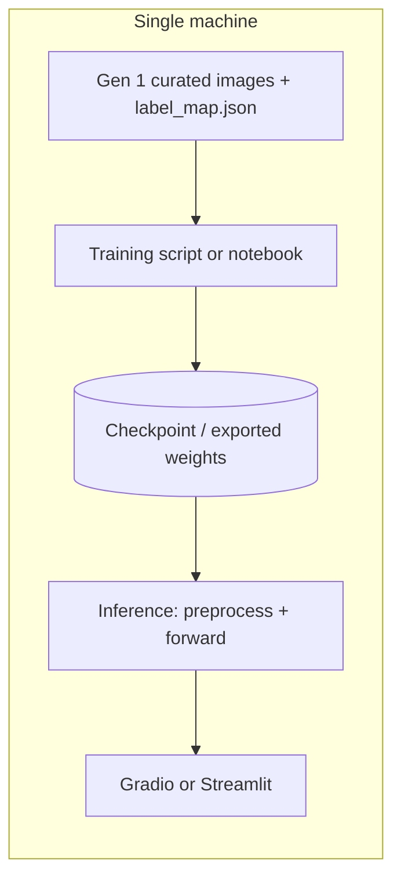

# Pokédex MVP — Scope and Plan

This document captures the agreed MVP for the Pokémon image recognition project: **Generation 1 only**, deployed as **local Python** with **Gradio or Streamlit**.

---

## Goals

- **Input:** A user-provided image or photo (ideally a single Pokémon in frame).
- **Output:** Predicted species (and confidence), aligned to the **National Pokédex** for Gen 1.
- **Non-goals for MVP:** Multi-Pokémon detection in one image, later generations, cloud hosting, mobile apps.

---

## Scope (Phase 0)

| Item | Decision |
|------|----------|
| **Generations** | **Generation 1 only** |
| **Classes** | **151** — National Dex **#1 (Bulbasaur)** through **#151 (Mew)** |
| **Deployment** | **Local Python** + **Gradio** *or* **Streamlit** (single process: model in memory + UI) |
| **Separate API** | Not required for MVP; inference runs in the same process as the UI |

### Labeling

- Use a **single source of truth**: `label_map.json` mapping **class index 0–150** (or 1–151, but be consistent) to **`{national_dex, canonical_name}`**.
- Normalize **names** across datasets (e.g. `Mr. Mime`, `Farfetch'd`) to avoid duplicate classes from spelling variants.
- When ingesting data, **keep only samples that map to dex 1–151**; ignore other generations for this MVP.

### Data sources (reference)

Training and evaluation may combine:

- [Kaggle — Pokémon Images Dataset (kvpratama)](https://www.kaggle.com/datasets/kvpratama/pokemon-images-dataset/data)
- [Kaggle — Pokémon Image Dataset (hlrhegemony)](https://www.kaggle.com/datasets/hlrhegemony/pokemon-image-dataset)
- [GitHub — HybridShivam/Pokemon](https://github.com/HybridShivam/Pokemon) (high-quality assets; useful for label checks and filling sparse classes)

**Data hygiene:** Deduplicate images (e.g. perceptual hash) *before* train/val/test splits. Use **stratified splits by class**. Address **class imbalance** if needed (weights, balanced sampling, or focal loss).

---

## Architecture (MVP)

Logical layout for a single machine:

- **`label_map.json`** — canonical dex ↔ name ↔ class index used at train and inference time.
- **Artifacts** — best checkpoint (and optional ONNX export later); preprocessing (resize, normalization) must **match** training exactly in `predict()`.

### Gradio vs Streamlit

- **Gradio:** Fastest path for image-in → labels-out demos.
- **Streamlit:** Convenient if you want extra views (e.g. metrics, confusion matrix) in the same app.

Pick **one** for the MVP to avoid duplicated UI work.

---

## Development plan

| Phase | Focus |
|-------|--------|
| **0** | Finalize 151-class mapping and `label_map.json`; define ingestion filter (dex 1–151 only). |
| **1** | Ingest, normalize labels, dedupe, stratified split; manifest CSV (`path`, `dex`, `class_index`, `split`). Implemented: `python scripts/build_manifest.py --data-root …` (see `data/raw/README.txt`). |
| **2** | Train a **transfer-learning** classifier; report val **Top-1** / **Top-3**. Baseline: **ResNet-18** + ImageNet weights (`python scripts/train.py`). Saves `artifacts/best_model.pt` + `train_config.json`. |
| **3** | Inference uses **val** preprocessing from `pokedex.training.build_transforms` (`pokedex/inference.TorchPredictor`). Loads `artifacts/best_model.pt`; optional `train_config.json`. |
| **4** | `app.py` (Gradio): loads checkpoint when present, else **dummy** predictor; Top-3 + names from `label_map.json`. |

---

## Suggested stack

- **Python 3.10+**
- **PyTorch** + **torchvision** (optional: **timm** for backbones)
- **Gradio** *or* **Streamlit**

---

## MVP success criteria (starting targets)

- **Val Top-1** on a held-out Gen 1 split: aim for a strong baseline (e.g. **≥85–90%**), then tune after seeing real numbers.
- **Preprocessing parity** between training and inference (no silent resize/normalize mismatch).
- **UI** shows at least **Top-3** predictions with readable species names.

---

## Risks (MVP)

| Risk | Mitigation |
|------|------------|
| Label noise across sources | Spot-check folders; cross-reference names with `label_map.json`. |
| Train/test leakage | Dedupe before splitting; do not tune on the test set. |
| User photos vs. artwork in training | Strong augmentation; optionally add a small set of real photos later. |

---

## Next steps

1. ~~Add `label_map.json` for dex **1–151**.~~
2. ~~Implement data ingestion (manifest) for Gen 1.~~ Place datasets under `data/raw/`, then run `scripts/build_manifest.py`.
3. ~~Train a baseline classifier (Phase 2) using `artifacts/manifest.csv`.~~ Run `python scripts/train.py` (after installing `torch` / `torchvision`).
4. ~~Gradio + trained checkpoint (Phase 3–4).~~ Run `python app.py` after training; uses `pokedex/inference.py` when `artifacts/best_model.pt` exists.

**Polish (optional):** test-set evaluation script, calibration for displayed probabilities, camera input in Gradio.
